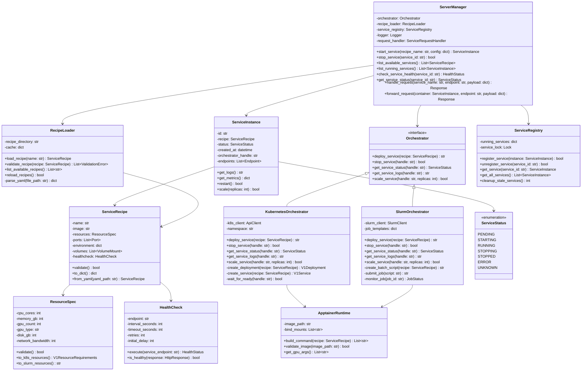
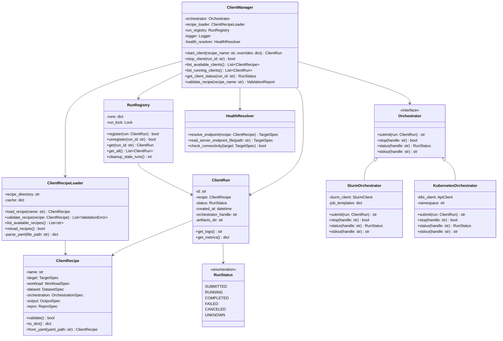
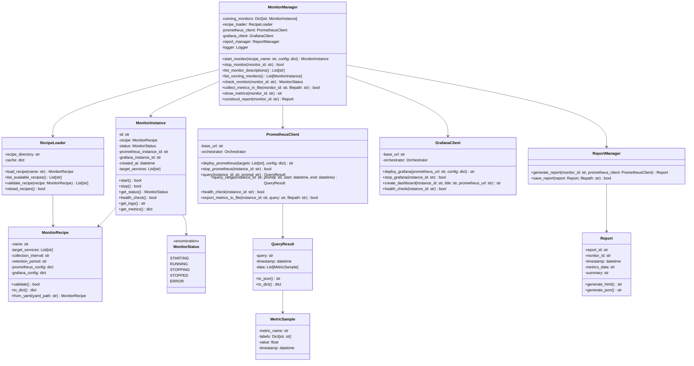

# UBenchAI-Framework: Unified Benchmarking Framework for AI Factory Workloads

## Project Overview
UBenchAI-Framework is a modular benchmarking framework designed to evaluate the performance of AI Factory components on the MeluXina supercomputer. This project is part of the EUMaster4HPC Student Challenge 2025-2026.

**Team 5 Members:**
- Alberto Taddei (@albtad01)
- Arianna Amadini (@AriannaAmadini)
- Dennys Huber (@dnyse)
- Elizabeth Koleva (@Elizabethvk)

## Setup and Installation

This project uses [Poetry](https://python-poetry.org/) for dependency management and packaging.

If you don't have Poetry installed, you can install it by following the [official installation guide](https://python-poetry.org/docs/#installation).

### Initial Setup

1. **Clone the repository**:
   ```bash
   git clone https://github.com/EUMaster4HPC-SC-Team-5/UBenchAI-Framework.git
   cd UBenchAI-Framework
   ```

2. **Install dependencies**:
   ```bash
   poetry install
   ```

3. **Activate the virtual environment**:
   ```bash
   eval $(poetry env activate)
   ```

4. **Verify installation**:
   ```bash
   poetry run ubenchai --version
   poetry run ubenchai --help
   ```

## Running the Framework

The UBenchAI Framework can be run in multiple ways:

### Method 1: Via Poetry (Recommended for Development)
```bash
# Using the installed command
poetry run ubenchai server list

# With verbose logging
poetry run ubenchai -v server start --recipe llm-inference

# Run client commands
poetry run ubenchai client run --recipe stress-test
```

### Method 2: Via Python Module
```bash
# Run as a module
poetry run python -m ubenchai server list
```

### Method 3: Via main.py
```bash
# Direct execution of main.py
poetry run python main.py server list
```

### Method 4: After Shell Activation
```bash
# Activate the environment first
poetry shell

# Then run directly
ubenchai server list
ubenchai client run --recipe test
ubenchai monitor start --recipe metrics
```

## Command Reference

### Server Module
Manage containerized AI services:

```bash
# Start a service from a recipe
ubenchai server start --recipe <recipe-name> [--config <config-file>]

# Stop a running service
ubenchai server stop <service-id>

# List available/running services
ubenchai server list

# Get service status
ubenchai server status <service-id>
```

**Example:**
```bash
poetry run ubenchai server start --recipe llm-inference
```

### Client Module
Run benchmarking workloads:

```bash
# Run a client workload
ubenchai client run --recipe <recipe-name> [--overrides <overrides-file>]

# Stop a running client
ubenchai client stop <run-id>

# List available/running clients
ubenchai client list

# Get client run status
ubenchai client status <run-id>
```

**Example:**
```bash
poetry run ubenchai client run --recipe stress-test
```

### Monitor Module
Start monitoring and metrics collection:

```bash
# Start monitoring
ubenchai monitor start --recipe <recipe-name> [--targets <service1,service2>]

# Stop monitoring
ubenchai monitor stop <monitor-id>

# List monitors
ubenchai monitor list

# Show metrics
ubenchai monitor metrics <monitor-id> [--output <file>]

# Generate report
ubenchai monitor report <monitor-id> [--format html|json|pdf]
```

**Example:**
```bash
poetry run ubenchai monitor start --recipe system-metrics --targets api-server,db-server
```

### Code Formatting

The project uses Black for code formatting:

```bash
# Format all code
poetry run black src/

# Check formatting without making changes
poetry run black --check src/
```

### Working on Specific Modules


#### Server Module
```bash
# Edit server implementation
vim src/ubenchai/servers/manager.py

# Test server commands
poetry run ubenchai server start --recipe test-recipe
```

#### Client Module
```bash
# Edit client implementation
vim src/ubenchai/clients/manager.py

# Test client commands
poetry run ubenchai client run --recipe test-workload
```

#### Monitor Module
```bash
# Edit monitor implementation
vim src/ubenchai/monitors/manager.py

# Test monitor commands
poetry run ubenchai monitor start --recipe test-monitor
```

#### Reporting Module
```bash
# Add reporting functionality
vim src/ubenchai/monitors/report.py

# Test report generation
poetry run ubenchai monitor report <monitor-id> --format html
```

## Logging

The framework uses `loguru` for structured logging:

- **Default log level**: INFO
- **Verbose mode**: DEBUG (use `-v` or `--verbose` flag)
- **Log files**: Automatically created in `logs/` directory with rotation
- **Log format**: `YYYY-MM-DD HH:mm:ss | LEVEL | module:function - message`

**Example with verbose logging:**
```bash
poetry run ubenchai -v server start --recipe test
```

## Environment Variables

You can configure the framework using environment variables:

```bash
# Set log level
export UBENCHAI_LOG_LEVEL=DEBUG

# Set configuration directory
export UBENCHAI_CONFIG_DIR=/path/to/configs

# Run with environment
poetry run ubenchai server list
```

## Troubleshooting

### "Module not found" errors
```bash
# Reinstall dependencies
poetry install

# Verify installation
poetry run python -c "import ubenchai; print(ubenchai.__version__)"
```

### "Command not found: ubenchai"
```bash
# Make sure you're using poetry run
poetry run ubenchai --help

# Or activate the environment first
poetry shell
ubenchai --help
```


## Architecture

### Server Module
The Server Module provides containerized service management for benchmark workloads using Apptainer containers. It handles service lifecycle management, request routing, and resource orchestration across both local development and HPC cluster environments.


#### Core Components
- **ServerManager**: Central orchestration component that manages the complete lifecycle of containerized AI services. Coordinates between recipe loading, service registry, orchestration, and request handling. Integrates directly with both Kubernetes and SLURM environments.
- **ServiceRegistry**: Registry that tracks all running service instances. Provides service discovery, cleanup of stale services, and access coordination.
- **ServiceInstance**: Represents a running containerized service with monitoring capabilities.
- **ServiceRecipe**: YAML-based service configuration defining container images, resource requirements, health checks, and deployment parameters.
- **RecipeLoader**: Manages discovery, loading, and validation of service recipes from the file system.
- **Orchestrator Implementations**
    - **KubernetesOrchestrator**: Native Kubernetes integration with Deployment and Service management. (Initial focus will lay on slurm)
    - **SlurmOrchestrator**: HPC cluster job submission with batch script generation and monitoring

### Client Module
The Client Module provides workload generation and benchmarking capabilities against containerized AI services. It handles client lifecycle management, recipe loading, run tracking, orchestration (local or SLURM), health resolution, and metrics collection.

#### Core Components

- **ClientManager**: Central orchestration component for managing benchmarking clients. Coordinates recipe loading, run tracking, orchestration, and health validation. Provides CLI commands for start/stop/list/status.  
- **ClientRecipe**: YAML-based configuration defining workload pattern (open/closed loop), dataset source, target endpoint (HTTP/gRPC/SQL/S3), and orchestration parameters (local/Slurm).  
- **ClientRun**: Represents a single benchmarking run. Stores recipe, run status, timestamps, orchestrator handle, and output artifacts.  
- **ClientRecipeLoader**: Manages discovery, parsing, and validation of client recipes from the filesystem. Provides schema validation and error reporting.  
- **RunRegistry**: Tracks active and historical client runs, supports cleanup, and ensures consistent metadata storage.  
- **Orchestrator Implementations**  
  - **SlurmOrchestrator**: Submits and manages benchmarking clients as HPC jobs via SLURM, handling job scripts and status polling.  
  - **KubernetesOrchestrator**: Provides analogous orchestration for K8s (optional, future extension).  
- **HealthResolver**: Resolves and validates server endpoints before client execution. Performs connectivity checks to ensure the target is reachable.


### Monitor Module
The Monitor Module provides lifecycle management for monitoring instances. It loads recipes, deploys Prometheus collectors, persists metrics for reporting and integrates with Grafana dashboards. It supports both local runs and HPC deployments (Slurm/K8S).



#### Core Components  
- **MonitorManager**: Central orchestration component that manages the complete lifecycle of monitoring runs. Coordinates recipe loading, monitor instances, Prometheus/Grafana integration, and metric export.  
- **MonitorInstance**: Represents a running monitoring session linked to a recipe. Provides status, logs, health checks, and collected metrics.  
- **MonitorRecipe**: YAML-based configuration defining monitoring targets, collection intervals, retention settings, and exporter options.  
- **RecipeLoader**: Manages discovery, validation, and loading of monitor recipes from the filesystem.  
- **PrometheusClient**: Deploys and manages Prometheus instances. Handles scraping configuration, queries, health checks, and metric export to files.  
- **GrafanaClient**: Deploys Grafana, connects it to Prometheus, and provisions dashboards for visualization.  


## Technology Stack
- **Python 3.12**: Primary development language.
- **Poetry**: Dependency management and build system
- **PyYAML 6.0.3+**: Service recipe parsing and configuration management
- **Loguru 0.7.3+**: Advanced logging with structured output and rotation
- **Black 25.9.0+**: Code formatting
- **Apptainer/Singularity:** Container runtime optimized for HPC environments
- **Pyslurm**: Python bindings for SLURM API 
- **kubernetes**: Official Kubernetes Python client (optional?)

## Task Assignment Strategy

### **Dennys Huber** - Server Module Lead
**Primary Responsibilities:**
- Lead the Core Server Framework
- Design ServerManager architecture
- Define ServiceRecipe YAML format
- Create ServiceRegistry tracking system

---

### **Alberto Taddei** - Client Module Lead
**Primary Responsibilities:**
- Lead the Core Client Framework
- Design ClientManager architecture
- Define client benchmark recipes
- Create workload execution patterns

---

### **Arianna Amadini** - Monitor Module Lead
**Primary Responsibilities:**
- Lead the Core Monitor Framework
- Design monitoring data collection
- Define metrics storage format
- Plan Grafana integration approach

---

### **Elizabeth Koleva** - Reporting Module Lead
**Primary Responsibilities:**
- Lead the Core Reporting Framework
- Design report generation system
- Define report templates
- Plan visualization approaches

---

## Shared Responsibilities (All Team Members)

- **Everyone:** Participate in design brainstorming sessions
- **Everyone:** Review and provide feedback on all designs

## Communication Plan

### Weekly Sync Meetings
- **Day:** To be decided by team
- **Duration:** 1 hour
- **Agenda:** Progress updates, blockers, design discussions

### Bi-weekly Mentor Sessions
- Present design progress
- Get feedback on technical approach
- Clarify requirements

### Async Communication
- Use GitHub Issues for task-specific discussions
- Update issue status regularly
- Tag team members for reviews

## Acknowledgments
- EUMaster4HPC Program
- LuxProvide and MeluXina Supercomputer
- Dr. Farouk Mansouri for supervision

